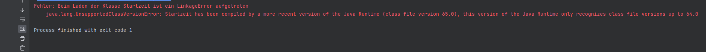

<h1> Projekt "Arbeitszeitkonto" </h1>

Ich habe diese Java-Klassen erstellt, um die Zeitdokumentation zu vereinfachen. Anstatt jedes Mal vor Beginn und nach Ende auf die Uhr zu schauen, die Zeiten aufzuschreiben und nachzurechnen, wie viel Zeit ich in dieses Projekt investiert habe, kann ich mit einem Klick diese Daten in einer Textdatei speichern und berechnen lassen.

Diesen Weg fand ich super, weil ich entscheiden kann, ob und wann die Zeit gespeichert werden soll und welche Projekte die Zeiterfassung überhaupt nutzen. So verhindere ich unnötige Datensätze, wie z.B. wenn das Projekt geöffnet wurde, um einen Abschnitt für ein anderes Projekt zu kopieren oder versehentlich geöffnet wurde. Ein weiterer Vorteil ist, dass die zusammengehörigen Datensätze gesammelt gespeichert werden und nicht mit den Daten anderer Projekte vermischt werden. Ich habe mich gegen eine Datenbank entschieden, da nicht auf jedem Rechner, mit dem ich arbeite, die entsprechende Software installiert ist. Es handelt sich um redundanten Datenspeicher, da die Daten in zwei Textdateien gespeichert werden (eine im Projekt und eine im "Arbeitszeitkonto"-Ordner).

## Anleitung

In diesem Abschnitt sind die Anleitungen hinterlegt, um die Zeiterfassung zu aktivieren. Lies dir die folgenden Anleitungen durch oder sieh dir mein [YouTube-Video](https://www.youtube.com/watch?v=GKgsSwaC2bk) an wo ich dich Schritt für Schritt durchführe. Sollte deine Java Version 20 oder neuer sein kannst du direkt zum Punkt 01:35 springen, da die Klassen bereit kompiliert sind.

- ### JRE Version 20+ 

1. Kopiere die Dateien, z.B. per GitHub, in den Projektordner, in dem die Zeit erfasst werden soll.
2. Falls nicht automatisch gesetzt, muss der "Arbeitszeitkonto"-Ordner als Source Root (Quell Root) gesetzt werden: Rechtsklick auf Arbeitszeitkonto, "Mark Directory as" -> "Source Root" (Blauer Ordner).
3. Links neben der Run-Schaltfläche auf "Current File" klicken -> "Edit Run Configuration" -> Plus -> "Application" -> Name z.B. "Start" -> Rotes Rechteck "Main class" die entsprechende Klasse auswählen -> "Modify options" -> "Add before Launch task" -> "Run External Tool" -> Plus -> Name z.B. "Startskript" -> "Program"-Rechteck auf Ordner -> Ordner suchen und Skript auswählen -> OK -> OK -> "Apply" & OK.

- ### JRE Version < 20

1. *.Class-Dateien aus dem Ordner löschen.
2. Den "Arbeitszeitkonto"-Ordner im Explorer öffnen, in die Pfadleiste "cmd" eingeben und Enter drücken.
3. Durch Eingabe von "java -version" die vorhandene Version überprüfen und merken, z.B. 20.?.??.
4. Den Befehl "javac -source X -target X [Dateinamen]" eingeben, wobei X durch die vorhandene Versionsnummer zu ersetzen und [Dateinamen] z.B. durch "Startzeit.java" zu ersetzen ist. Enter drücken. Für die anderen Dateinamen den Vorgang wiederholen oder den vorherigen Befehl mit der Pfeiltaste nach oben aufrufen, Anfangsbuchstaben + TAB drücken, um den Namen zu ersetzen.
5. Der oberen Anleitung folgen.

## Fehler

Solltest du diesen fehler in der IntelliJ-IDE Konsole angezeigt bekommen, liegt es daran, dass deine Java-Version älter ist als deine kompilierte .Class-Datei Version. Um diesen Fehler zu beheben musst du der Anleitung "JRE Version < 20" folgen oder zum Punkt 00:32 im [YouTube-Video](https://www.youtube.com/watch?v=GKgsSwaC2bk) springen.

